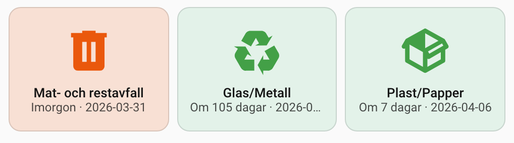
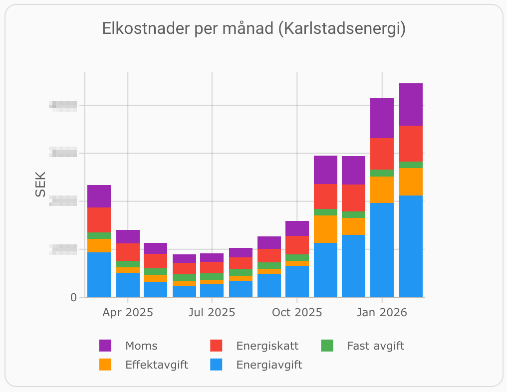
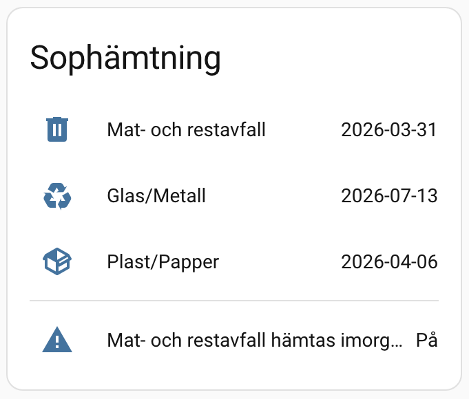
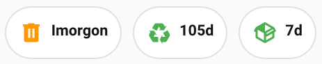

# Karlstadsenergi for Home Assistant

[![GitHub Release][releases-shield]][releases]
[![License][license-shield]](LICENSE)

[![hacs][hacsbadge]][hacs]
[![Project Maintenance][maintenance-shield]][user_profile]
[![BuyMeCoffee][buymecoffeebadge]][buymecoffee]

A Home Assistant integration for [Karlstads Energi](https://www.karlstadsenergi.se/) customers. Track waste collection pickup dates and electricity consumption.

> **Disclaimer:** This is an unofficial integration built entirely for personal use. It talks to Karlstads Energi's customer portal through a reverse-engineered API that could break at any time -- so we really can't recommend that anyone else use it.
>
> It exists because [@krissen](https://github.com/krissen) got new waste bins with a new pickup schedule and kept dragging the wrong ones to the curb on cold Värmland mornings. Automation to the rescue. It's shared here in case someone else in Karlstad has the same problem. If that's you -- välkommen, and good luck.

<table align="center"><tr>
  <td></td>
  <td></td>
</tr></table>

> *Right: Monthly cost breakdown rendered with [Plotly Graph Card](https://github.com/dbuezas/lovelace-plotly-graph-card). The winter spike? That's [@krissen](https://github.com/krissen) running a full-scale kitchen renovation in January -- turns out power tools and temporary heating don't do wonders for the electricity bill.*

---

## Features

- **Waste collection sensors** -- Next pickup date for each waste type (food & residual waste, glass/metal, plastic & paper packaging)
- **Waste collection calendar** -- Calendar entities, works with HA's built-in Calendar card and [Mushroom Cards](https://github.com/piitaya/lovelace-mushroom)
- **Pickup reminders** -- Binary sensors for "pickup tomorrow" per waste type
- **Electricity consumption** -- Daily and hourly consumption data with year-over-year comparison, Energy Dashboard compatible
- **Electricity price** -- Effective energy price (SEK/kWh) derived from your invoice fee breakdown, Energy Dashboard compatible
- **Cost breakdown** -- Individual sensors for each invoice fee component: consumption fee, power fee, fixed fee, energy tax, VAT, and total cost (SEK), with monthly long-term statistics for the Energy Dashboard
- **Spot price** -- Current Nord Pool SE3 spot price (15-minute intervals) from Karlstadsenergi/Evado public API
- **Historical statistics** -- Hourly consumption and monthly cost data imported into HA long-term statistics with configurable depth (1--10 years, default 2). The portal API has data going back to contract start -- this integration unlocks it for Energy Dashboard graphs and history analysis.
- **Contract overview** -- Sensors for each contract (grid, trading, waste) with contract type, dates, and identifiers
- **Computed attributes** -- `days_until_pickup`, `pickup_is_today`, `pickup_is_tomorrow`
- **Session management** -- Automatic session keepalive (heartbeat), cookie persistence across restarts, and re-authentication on session expiry
- **Configurable update interval** -- Set how often data is refreshed (1--24 hours)

---

## Installation

### HACS (recommended)

1. Open HACS in Home Assistant.
2. Go to **Integrations** and click the three-dot menu in the top right.
3. Select **Custom repositories**.
4. Add `https://github.com/krissen/karlstadsenergi-homeassistant` as an **Integration**.
5. Search for **Karlstadsenergi** and install it.
6. Restart Home Assistant.

### Manual

1. Copy the `custom_components/karlstadsenergi` directory into your Home Assistant `config/custom_components/` directory.
2. Restart Home Assistant.

---

## Configuration

1. Go to **Settings -> Devices & Services -> Add Integration**.
2. Search for `Karlstadsenergi`.
3. Choose your authentication method (see below).

### Authentication methods

The integration supports two login methods. **Customer number & password is strongly recommended.**

| | Customer number & password | Mobile BankID |
|---|---|---|
| **Recommended** | **Yes** | **No** -- avoid if possible |
| Auto-reconnect on HA restart | **Yes** -- automatic | **No** -- requires manual re-scan |
| Session handling | Automatic re-login | Heartbeat keep-alive only |
| Setup complexity | Simple | Requires manual BankID app sign-in |
| Multi-account | Logs in directly | Must select account each time |

#### Customer number & password (recommended)

1. Select **Kundnummer & lösenord**.
2. Enter your Karlstads Energi customer number and password.

> **Don't have a password yet?** Go to [Karlstadsenergi Password Reset](https://minasidor.karlstadsenergi.se/Customer/PasswordReset.aspx). Have your customer number ready (found on your invoice). Enter the customer number and a password reset link will be sent to the email address Karlstads Energi has on file for your account. Then you're good to go!

#### Mobile BankID (not recommended)

> **Warning:** BankID is available but **we do not recommend using it.** When Home Assistant restarts, the session expires and **you must manually sign in with the BankID app** every time to reconnect. There is no way to automate BankID re-authentication. It is only included as a fallback for users who cannot set up password login. If at all possible, set up customer number & password instead.

1. Select **Mobilt BankID**.
2. Enter your personnummer (Swedish personal identity number).
3. In the config flow, click the **Open BankID app** link and sign in with BankID.
4. If your personnummer is linked to multiple accounts, select which one to use.

> **Note:** Home Assistant config flows cannot render the QR image from the upstream API. This integration therefore uses the `bankid://` deep link in the flow description instead.

### Options

After setup, go to **Settings -> Devices & Services -> Karlstadsenergi -> Configure** to adjust:

| Setting | Default | Range | Description |
|---------|---------|-------|-------------|
| Update interval | 6 hours | 1--24 hours | How often to fetch new data |
| Statistics history | 2 years | 1--10 years | How far back to import hourly consumption and monthly cost data |

> **Tip:** Waste pickup dates rarely change, so 6--12 hours is usually sufficient. Electricity consumption updates more frequently (1/6 of the waste interval, minimum 1 hour). The history setting affects the first import only -- subsequent refreshes only add new data points. Two years imports ~19,000 hourly data points; larger values are fine but the initial import takes longer.

---

## Entities and automations

<table><tr>
  <td></td>
  <td></td>
</tr></table>

See **[Entities](docs/user/entities.md)** for a reference of all sensors, calendars, binary sensors, and their attributes, with automation examples.

---

## Dashboard examples

  

  

See **[Dashboard examples](docs/user/dashboard-examples.md)** for card configurations using Mushroom Cards, Custom Button Card, and the built-in Calendar card.

---

## Advanced usage

See **[Advanced usage](docs/user/advanced.md)** for service calls, manual data refresh, template sensors (pickup countdown, cost estimates, price level), spot price automations, and smart plug control.

---

## Troubleshooting

### BankID authentication fails

- Make sure you are signing with the correct personnummer in BankID.
- The BankID start token has a limited validity window. If it expires, click Submit again to start a new BankID attempt.
- If re-authentication is triggered (session expired), you will need to manually sign in with BankID again.

### Sensors show "unavailable"

- The Karlstads Energi portal may be temporarily down for maintenance.
- Your session may have expired. The integration will attempt to re-authenticate automatically. For BankID users, a re-authentication prompt will appear in Home Assistant notifications.
- Check the Home Assistant logs for error details.

### Consumption data is missing

- Electricity consumption data requires that the server-side session state is properly initialized. The integration handles this by visiting required pages before making API calls.
- Not all customer accounts have electricity services. If you only have waste collection, this is expected.

### Update interval

- Waste data updates at the configured interval (default: 6 hours).
- Electricity consumption and fee data updates 6x more frequently (default: 1 hour).
- Contract data updates once per day.
- Spot prices update every 15 minutes (public API, no authentication required).
- To trigger an immediate refresh, use the `homeassistant.update_entity` service.

---

## Known limitations

### Electricity consumption data lag

The portal API provides historical consumption data only. Depending on your meter and billing cycle, data may lag days or weeks behind real-time. The `latest_date` attribute on the electricity consumption sensor shows the actual date of the most recent data point -- use this to judge how current the data is.

### Electricity consumption and Energy Dashboard accuracy

The consumption sensor uses `state_class: total_increasing` with the cumulative year-to-date value (`CurrYearValue`) from the portal API. This value increases monotonically within a year and resets in January -- `total_increasing` handles the annual reset correctly. However, if Karlstadsenergi retroactively corrects `CurrYearValue` downward (e.g. a billing adjustment), HA's long-term statistics will ignore the lower value and the Energy Dashboard may show inflated totals. This is a known limitation of `total_increasing` with an API source that is not a physical meter counter. No such corrections have been observed in practice.

### Orphaned entity registry entries

The integration creates waste entities in one of two modes -- detailed (one entity per service line) or summary (one entity per waste type) -- depending on what data the API returns at startup. If the mode changes between restarts (for example, the detailed Flex API becomes available after initially being unreachable), both sets of entities may appear in the entity registry and the old set will show as "unavailable". To remove the stale entries: go to **Settings -> Devices & Services -> Entities**, filter by "unavailable", and delete them manually.

### Personnummer in API URLs

The upstream Karlstadsenergi portal API requires the personnummer in URL paths when authenticating via BankID. All communication with the portal uses HTTPS, so the URL path (including the personnummer) is encrypted in transit. This is an upstream API design decision that this integration cannot change.

---

## Development

See **[Development documentation](docs/DEVELOPMENT.md)** for architecture details, API notes, and how to set up a development environment.

---

## Data source

All data is retrieved from the [Karlstads Energi customer portal](https://minasidor.karlstadsenergi.se). This integration is not affiliated with or endorsed by Karlstads Energi AB.

---

[Want to support development? Buy me a coffee!](https://coff.ee/krissen)

---

[hacs]: https://hacs.xyz
[hacsbadge]: https://img.shields.io/badge/HACS-Custom-orange.svg?style=for-the-badge
[license-shield]: https://img.shields.io/github/license/krissen/karlstadsenergi-homeassistant.svg?style=for-the-badge
[maintenance-shield]: https://img.shields.io/badge/maintainer-%40krissen-blue.svg?style=for-the-badge
[releases-shield]: https://img.shields.io/github/release/krissen/karlstadsenergi-homeassistant.svg?style=for-the-badge
[releases]: https://github.com/krissen/karlstadsenergi-homeassistant/releases
[user_profile]: https://github.com/krissen
[buymecoffee]: https://coff.ee/krissen
[buymecoffeebadge]: https://img.shields.io/badge/buy%20me%20a%20coffee-donate-yellow.svg?style=for-the-badge
