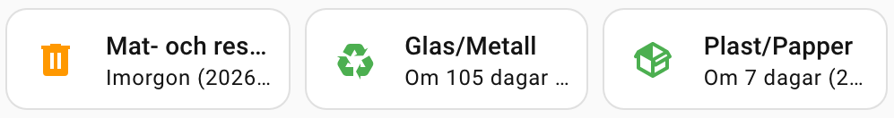
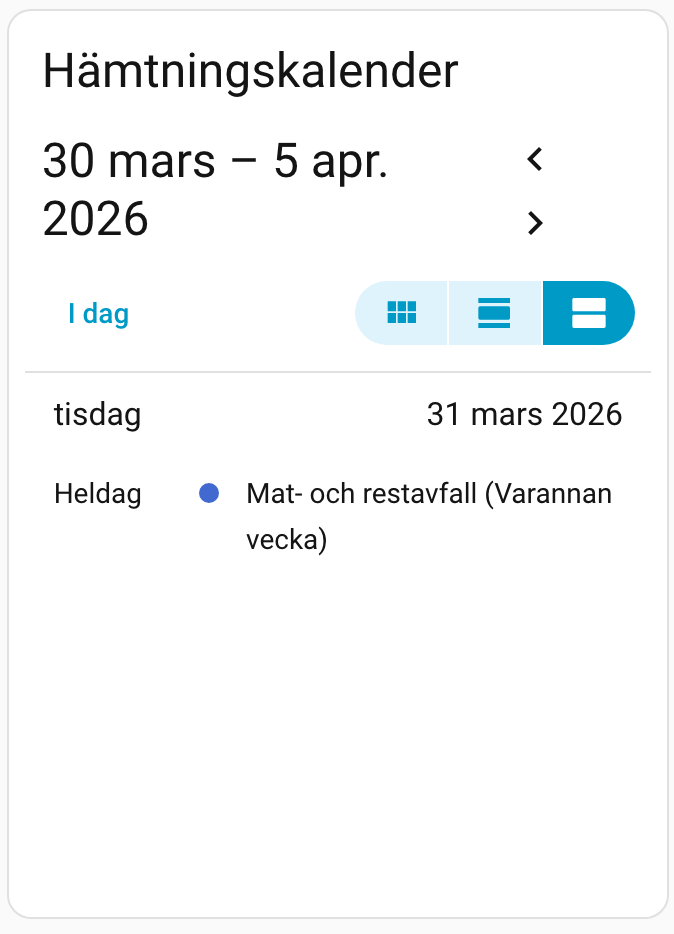
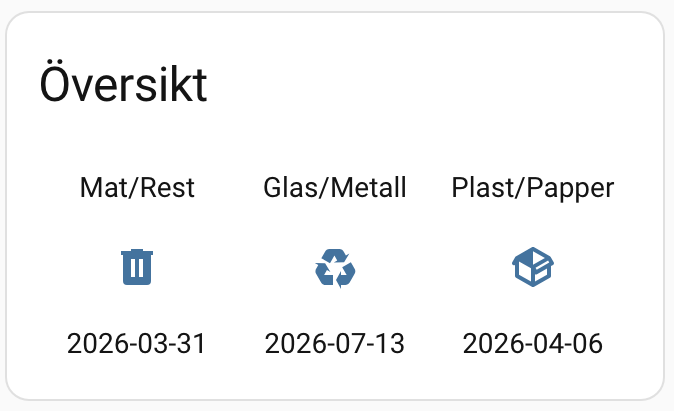
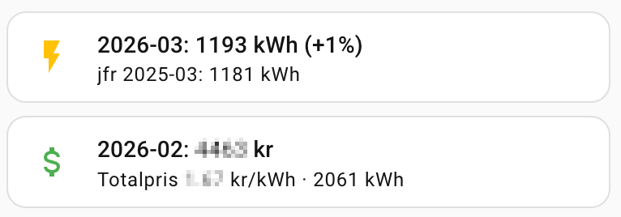

# Dashboard examples

Examples for displaying waste collection data on your Home Assistant dashboard. All examples use the entity IDs created by the Karlstadsenergi integration.

> **Note:** Entity IDs in the examples below are illustrative. Your actual entity IDs depend on your address and installation. Replace them with the IDs shown in **Settings -> Devices & Services -> Karlstadsenergi** before using these examples.

> **Tip:** The examples below use Swedish labels to match the waste type names from Karlstads Energi. Change them to whatever language you prefer.

---

## Prerequisites

Some examples require custom frontend cards from HACS:

| Card | HACS name | Required by |
|------|-----------|-------------|
| [Mushroom](https://github.com/piitaya/lovelace-mushroom) | `lovelace-mushroom` | Approaches 1a--1c, 4a--4b |
| [card-mod](https://github.com/thomasloven/lovelace-card-mod) | `lovelace-card-mod` | Approach 1b (background tinting) |
| [Custom Button Card](https://github.com/custom-cards/button-card) | `lovelace-button-card` | Approach 2 |

Approach 3 uses only built-in HA cards -- no HACS frontend dependencies.

---

## 1. Mushroom Cards

Color-coded cards showing days until pickup.

**Color logic:** green (7+ days), yellow (2--6 days), orange (tomorrow), red (today).

### 1a. Template card grid



Three cards in a grid, one per waste type.

```yaml
type: grid
columns: 3
square: false
cards:

  - type: custom:mushroom-template-card
    entity: sensor.karlstadsenergi_food_and_residual_waste
    primary: Mat- och restavfall
    secondary: >-
      
      
      Hämtas IDAG
      Imorgon ({{ states('sensor.karlstadsenergi_food_and_residual_waste') }})
      Inväntar uppdatering · {{ p }}
      Om {{ d }} dagar ({{ states('sensor.karlstadsenergi_food_and_residual_waste') }})
      Okänt datum
    icon: mdi:trash-can
    icon_color: >-
      
      
      disabled
      disabled
      red
      orange
      yellow
      green

  - type: custom:mushroom-template-card
    entity: sensor.karlstadsenergi_glass_metal
    primary: Glas/Metall
    secondary: >-
      
      
      Hämtas IDAG
      Imorgon ({{ states('sensor.karlstadsenergi_glass_metal') }})
      Inväntar uppdatering · {{ p }}
      Om {{ d }} dagar ({{ states('sensor.karlstadsenergi_glass_metal') }})
      Okänt datum
    icon: mdi:recycle
    icon_color: >-
      
      
      disabled
      disabled
      red
      orange
      yellow
      green

  - type: custom:mushroom-template-card
    entity: sensor.karlstadsenergi_plastic_paper_packaging
    primary: Plast- och pappersförpackningar
    secondary: >-
      
      
      Hämtas IDAG
      Imorgon ({{ states('sensor.karlstadsenergi_plastic_paper_packaging') }})
      Inväntar uppdatering · {{ p }}
      Om {{ d }} dagar ({{ states('sensor.karlstadsenergi_plastic_paper_packaging') }})
      Okänt datum
    icon: mdi:package-variant
    icon_color: >-
      
      
      disabled
      disabled
      red
      orange
      yellow
      green
```

### 1b. With card-mod background tinting

Same layout but tints the entire card background. Requires card-mod in addition to Mushroom.

```yaml
type: grid
columns: 3
square: false
cards:

  - type: custom:mushroom-template-card
    entity: sensor.karlstadsenergi_food_and_residual_waste
    primary: Mat- och restavfall
    secondary: >-
      
      
      Hämtas IDAG
      Imorgon · {{ states('sensor.karlstadsenergi_food_and_residual_waste') }}
      Inväntar uppdatering · {{ p }}
      Om {{ d }} dagar · {{ states('sensor.karlstadsenergi_food_and_residual_waste') }}
      Okänt datum
    icon: mdi:trash-can
    icon_color: >-
      
      
      disableddisabledredorangeyellowgreen
    card_mod:
      style: >
        
        
        ha-card {
          background: rgba(128,128,128,0.08);
          background: rgba(128,128,128,0.08);
          background: rgba(var(--rgb-red), 0.12);
          background: rgba(var(--rgb-orange), 0.10);
          background: rgba(var(--rgb-yellow), 0.08);
          background: rgba(var(--rgb-green), 0.06);
          
        }

  - type: custom:mushroom-template-card
    entity: sensor.karlstadsenergi_glass_metal
    primary: Glas/Metall
    secondary: >-
      
      
      Hämtas IDAG
      Imorgon · {{ states('sensor.karlstadsenergi_glass_metal') }}
      Inväntar uppdatering · {{ p }}
      Om {{ d }} dagar · {{ states('sensor.karlstadsenergi_glass_metal') }}
      Okänt datum
    icon: mdi:recycle
    icon_color: >-
      
      
      disableddisabledredorangeyellowgreen
    card_mod:
      style: >
        
        
        ha-card {
          background: rgba(128,128,128,0.08);
          background: rgba(128,128,128,0.08);
          background: rgba(var(--rgb-red), 0.12);
          background: rgba(var(--rgb-orange), 0.10);
          background: rgba(var(--rgb-yellow), 0.08);
          background: rgba(var(--rgb-green), 0.06);
          
        }

  - type: custom:mushroom-template-card
    entity: sensor.karlstadsenergi_plastic_paper_packaging
    primary: Plast- och pappersförpackningar
    secondary: >-
      
      
      Hämtas IDAG
      Imorgon · {{ states('sensor.karlstadsenergi_plastic_paper_packaging') }}
      Inväntar uppdatering · {{ p }}
      Om {{ d }} dagar · {{ states('sensor.karlstadsenergi_plastic_paper_packaging') }}
      Okänt datum
    icon: mdi:package-variant
    icon_color: >-
      
      
      disableddisabledredorangeyellowgreen
    card_mod:
      style: >
        
        
        ha-card {
          background: rgba(128,128,128,0.08);
          background: rgba(128,128,128,0.08);
          background: rgba(var(--rgb-red), 0.12);
          background: rgba(var(--rgb-orange), 0.10);
          background: rgba(var(--rgb-yellow), 0.08);
          background: rgba(var(--rgb-green), 0.06);
          
        }
```

> **Note:** `--rgb-red`, `--rgb-orange` etc. are CSS variables defined by HA's default theme and most popular themes. If your theme doesn't define them, replace with hex values (e.g., `rgba(220,38,38,0.12)`).

### 1c. Chips (compact status bar)


A single row for the top of a view. Each chip shows the icon and days remaining.

```yaml
type: custom:mushroom-chips-card
chips:

  - type: template
    entity: sensor.karlstadsenergi_food_and_residual_waste
    icon: mdi:trash-can
    content: >-
      
      
      Idag!Imorgongammalt{{ d }}d-
    icon_color: >-
      
      
      disableddisabledredorangeyellowgreen

  - type: template
    entity: sensor.karlstadsenergi_glass_metal
    icon: mdi:recycle
    content: >-
      
      
      Idag!Imorgongammalt{{ d }}d-
    icon_color: >-
      
      
      disableddisabledredorangeyellowgreen

  - type: template
    entity: sensor.karlstadsenergi_plastic_paper_packaging
    icon: mdi:package-variant
    content: >-
      
      
      Idag!Imorgongammalt{{ d }}d-
    icon_color: >-
      
      
      disableddisabledredorangeyellowgreen
```

---

## 2. Custom Button Card

Color-coded cards using button-card's JavaScript templates.


```yaml
type: grid
columns: 3
square: false
cards:

  - type: custom:button-card
    entity: sensor.karlstadsenergi_food_and_residual_waste
    triggers_update: sensor.time
    name: Mat- och restavfall
    icon: mdi:trash-can
    show_icon: true
    show_name: true
    show_label: true
    show_state: false
    size: 40%
    label: >
      [[[
        const s = entity.state;
        const d = (s && s !== 'unknown' && s !== 'unavailable') ? Math.round((new Date(s + 'T00:00:00') - new Date(new Date().setHours(0, 0, 0, 0))) / 86400000) : null;
        if (d === undefined || d === null) return 'Okänt datum';
        if (d === 0) return 'Hämtas IDAG';
        if (d === 1) return 'Imorgon · ' + entity.state;
        if (d < 0) return 'Inväntar uppdatering · ' + entity.state;
        return 'Om ' + d + ' dagar · ' + entity.state;
      ]]]
    styles:
      card:
        - border-radius: 12px
        - padding: 16px 12px
        - background: >
            [[[
              const s = entity.state;
              const d = (s && s !== 'unknown' && s !== 'unavailable') ? Math.round((new Date(s + 'T00:00:00') - new Date(new Date().setHours(0, 0, 0, 0))) / 86400000) : null;
              if (d === undefined || d === null) return 'rgba(128,128,128,0.1)';
              if (d < 0) return 'rgba(128,128,128,0.1)';
              if (d === 0) return 'rgba(220,38,38,0.18)';
              if (d === 1) return 'rgba(234,88,12,0.16)';
              if (d <= 6) return 'rgba(202,138,4,0.12)';
              return 'rgba(22,163,74,0.10)';
            ]]]
      icon:
        - color: >
            [[[
              const s = entity.state;
              const d = (s && s !== 'unknown' && s !== 'unavailable') ? Math.round((new Date(s + 'T00:00:00') - new Date(new Date().setHours(0, 0, 0, 0))) / 86400000) : null;
              if (d === undefined || d === null) return 'var(--disabled-color)';
              if (d < 0) return 'var(--disabled-color)';
              if (d === 0) return 'var(--error-color)';
              if (d === 1) return '#ea580c';
              if (d <= 6) return '#ca8a04';
              return 'var(--success-color)';
            ]]]
      name:
        - font-size: 13px
        - font-weight: 500
        - margin-top: 8px
      label:
        - font-size: 12px
        - opacity: '0.75'

  - type: custom:button-card
    entity: sensor.karlstadsenergi_glass_metal
    triggers_update: sensor.time
    name: Glas/Metall
    icon: mdi:recycle
    show_icon: true
    show_name: true
    show_label: true
    show_state: false
    size: 40%
    label: >
      [[[
        const s = entity.state;
        const d = (s && s !== 'unknown' && s !== 'unavailable') ? Math.round((new Date(s + 'T00:00:00') - new Date(new Date().setHours(0, 0, 0, 0))) / 86400000) : null;
        if (d === undefined || d === null) return 'Okänt datum';
        if (d === 0) return 'Hämtas IDAG';
        if (d === 1) return 'Imorgon · ' + entity.state;
        if (d < 0) return 'Inväntar uppdatering · ' + entity.state;
        return 'Om ' + d + ' dagar · ' + entity.state;
      ]]]
    styles:
      card:
        - border-radius: 12px
        - padding: 16px 12px
        - background: >
            [[[
              const s = entity.state;
              const d = (s && s !== 'unknown' && s !== 'unavailable') ? Math.round((new Date(s + 'T00:00:00') - new Date(new Date().setHours(0, 0, 0, 0))) / 86400000) : null;
              if (d === undefined || d === null) return 'rgba(128,128,128,0.1)';
              if (d < 0) return 'rgba(128,128,128,0.1)';
              if (d === 0) return 'rgba(220,38,38,0.18)';
              if (d === 1) return 'rgba(234,88,12,0.16)';
              if (d <= 6) return 'rgba(202,138,4,0.12)';
              return 'rgba(22,163,74,0.10)';
            ]]]
      icon:
        - color: >
            [[[
              const s = entity.state;
              const d = (s && s !== 'unknown' && s !== 'unavailable') ? Math.round((new Date(s + 'T00:00:00') - new Date(new Date().setHours(0, 0, 0, 0))) / 86400000) : null;
              if (d === undefined || d === null) return 'var(--disabled-color)';
              if (d < 0) return 'var(--disabled-color)';
              if (d === 0) return 'var(--error-color)';
              if (d === 1) return '#ea580c';
              if (d <= 6) return '#ca8a04';
              return 'var(--success-color)';
            ]]]
      name:
        - font-size: 13px
        - font-weight: 500
        - margin-top: 8px
      label:
        - font-size: 12px
        - opacity: '0.75'

  - type: custom:button-card
    entity: sensor.karlstadsenergi_plastic_paper_packaging
    triggers_update: sensor.time
    name: Plast/Papper
    icon: mdi:package-variant
    show_icon: true
    show_name: true
    show_label: true
    show_state: false
    size: 40%
    label: >
      [[[
        const s = entity.state;
        const d = (s && s !== 'unknown' && s !== 'unavailable') ? Math.round((new Date(s + 'T00:00:00') - new Date(new Date().setHours(0, 0, 0, 0))) / 86400000) : null;
        if (d === undefined || d === null) return 'Okänt datum';
        if (d === 0) return 'Hämtas IDAG';
        if (d === 1) return 'Imorgon · ' + entity.state;
        if (d < 0) return 'Inväntar uppdatering · ' + entity.state;
        return 'Om ' + d + ' dagar · ' + entity.state;
      ]]]
    styles:
      card:
        - border-radius: 12px
        - padding: 16px 12px
        - background: >
            [[[
              const s = entity.state;
              const d = (s && s !== 'unknown' && s !== 'unavailable') ? Math.round((new Date(s + 'T00:00:00') - new Date(new Date().setHours(0, 0, 0, 0))) / 86400000) : null;
              if (d === undefined || d === null) return 'rgba(128,128,128,0.1)';
              if (d < 0) return 'rgba(128,128,128,0.1)';
              if (d === 0) return 'rgba(220,38,38,0.18)';
              if (d === 1) return 'rgba(234,88,12,0.16)';
              if (d <= 6) return 'rgba(202,138,4,0.12)';
              return 'rgba(22,163,74,0.10)';
            ]]]
      icon:
        - color: >
            [[[
              const s = entity.state;
              const d = (s && s !== 'unknown' && s !== 'unavailable') ? Math.round((new Date(s + 'T00:00:00') - new Date(new Date().setHours(0, 0, 0, 0))) / 86400000) : null;
              if (d === undefined || d === null) return 'var(--disabled-color)';
              if (d < 0) return 'var(--disabled-color)';
              if (d === 0) return 'var(--error-color)';
              if (d === 1) return '#ea580c';
              if (d <= 6) return '#ca8a04';
              return 'var(--success-color)';
            ]]]
      name:
        - font-size: 13px
        - font-weight: 500
        - margin-top: 8px
      label:
        - font-size: 12px
        - opacity: '0.75'
```

> **Tip:** To reduce repetition, button-card supports shared templates via `button_card_templates`. See the [button-card documentation](https://github.com/custom-cards/button-card#configuration-templates) for details.

---

## 3. Built-in HA cards (no HACS required)

### 3a. Calendar card



Shows all waste calendars in HA's native calendar view.

```yaml
type: calendar
entities:
  - calendar.karlstadsenergi_food_and_residual_waste_calendar
  - calendar.karlstadsenergi_glass_metal_calendar
  - calendar.karlstadsenergi_plastic_paper_packaging_calendar
initial_view: listWeek
```

### 3b. Entities card with conditional rows


Pickup dates always visible; alert rows appear only when a pickup is tomorrow.

```yaml
type: entities
title: Sophämtning
entities:
  - entity: sensor.karlstadsenergi_food_and_residual_waste
    name: Mat- och restavfall
    icon: mdi:trash-can
  - entity: sensor.karlstadsenergi_glass_metal
    name: Glas/Metall
    icon: mdi:recycle
  - entity: sensor.karlstadsenergi_plastic_paper_packaging
    name: Plast/Papper
    icon: mdi:package-variant
  - type: divider
  - type: conditional
    conditions:
      - condition: state
        entity: binary_sensor.karlstadsenergi_food_and_residual_waste_pickup_tomorrow
        state: "on"
    row:
      entity: binary_sensor.karlstadsenergi_food_and_residual_waste_pickup_tomorrow
      name: Mat- och restavfall hämtas imorgon
      icon: mdi:alert
  - type: conditional
    conditions:
      - condition: state
        entity: binary_sensor.karlstadsenergi_glass_metal_pickup_tomorrow
        state: "on"
    row:
      entity: binary_sensor.karlstadsenergi_glass_metal_pickup_tomorrow
      name: Glas/Metall hämtas imorgon
      icon: mdi:alert
  - type: conditional
    conditions:
      - condition: state
        entity: binary_sensor.karlstadsenergi_plastic_paper_packaging_pickup_tomorrow
        state: "on"
    row:
      entity: binary_sensor.karlstadsenergi_plastic_paper_packaging_pickup_tomorrow
      name: Plast/Papper hämtas imorgon
      icon: mdi:alert
```

### 3c. Glance card (most compact)



```yaml
type: glance
title: Sophämtning
columns: 3
show_state: true
entities:
  - entity: sensor.karlstadsenergi_food_and_residual_waste
    name: Mat/Rest
    icon: mdi:trash-can
  - entity: sensor.karlstadsenergi_glass_metal
    name: Glas/Metall
    icon: mdi:recycle
  - entity: sensor.karlstadsenergi_plastic_paper_packaging
    name: Plast/Papper
    icon: mdi:package-variant
```

---

## 4. Electricity sensors (Mushroom)



> **Note:** Entity IDs in the examples below are illustrative. Your actual entity IDs depend on your configuration. Replace them with the IDs shown in **Settings -> Devices & Services -> Karlstadsenergi**.

### 4a. Consumption card

Shows the latest complete month's consumption with year-over-year comparison. Falls back to previous month when same-month-last-year is unavailable.

```yaml
- type: custom:mushroom-template-card
  entity: sensor.karlstadsenergi_electricity_consumption
  primary: >-
    
    
    
    {{ state_attr(e, 'latest_month') }}: {{ kwh | round(0) }} kWh (+{{ d }}%)
    {{ state_attr(e, 'latest_month') }}: {{ kwh | round(0) }} kWh
    Elförbrukning
  secondary: >-
    
    
    
    jfr {{ ym }}: {{ ref | round(0) }} kWh
    —
  icon: mdi:flash
  icon_color: amber
```

### 4b. Electricity price card

Shows the latest invoiced month's total fee and effective variable price per kWh.

```yaml
- type: custom:mushroom-template-card
  entity: sensor.karlstadsenergi_electricity_price
  primary: >-
    
    
    {{ month }}: {{ total | round(0) }} kr
    Elpris
  secondary: >-
    
    
    Totalpris {{ price | round(2) }} kr/kWh · {{ kwh | round(0) }} kWh
    —
  icon: mdi:currency-usd
  icon_color: green
```

### 4c. Consumption per day (statistics graph)

A built-in `statistics-graph` card showing daily consumption from the external statistic. No HACS card required.

```yaml
- type: statistics-graph
  title: Elförbrukning per dag (30 dagar)
  chart_type: bar
  entities:
    - karlstadsenergi:electricity_consumption_166667   # use your own customer_id
  period: day
  stat_types:
    - change
  days_to_show: 30
  hide_legend: true
```

> **Use `change`, not `state`.** The consumption (and cost) statistics are cumulative *sum* statistics. `change` plots the amount consumed **during** each day -- the real daily total (~20 kWh). `stat_types: [state]` looks plausible but plots each day's **last hourly reading** (~1 kWh), so the whole graph comes out roughly 20x too low. The same applies to a per-day/per-month cost graph built on the `karlstadsenergi:cost_*` statistics.

---

## Other options

### TrashCard

[TrashCard](https://github.com/idaho/hassio-trash-card) is a dedicated waste collection card that works with HA calendar entities. It can consume the calendar entities from this integration directly. However, as of early 2026, the project has not seen a release or maintainer activity in over a year. It may still work, but consider the approaches above as more actively maintained alternatives.

---

## Design notes

**Color thresholds.** All examples above use this scheme:

| Days until pickup | Color | Meaning |
|-------------------|-------|---------|
| 7+ | Green | Normal |
| 2--6 | Yellow | Coming up |
| 1 | Orange | Tomorrow |
| 0 | Red | Today |
| < 0 | Grey | Passed without fresh data |

Adjust `d <= 6` to `d <= 13` if your waste is collected every two weeks and you want the yellow warning earlier.

**Live countdown.** All examples compute the day count from the sensor's *state* (the absolute pickup date) rather than the `days_until_pickup` attribute, so the countdown stays correct even when a BankID session has expired and the integration can no longer refresh -- the absolute date does not change, only how many days remain. The Mushroom/Jinja templates reference `now()`, which Home Assistant re-renders every minute, so they update on their own. The `custom:button-card` examples are JavaScript and only re-evaluate when a tracked entity changes; the examples add `triggers_update: sensor.time` so they refresh every minute too -- this needs the [Time & Date](https://www.home-assistant.io/integrations/time_date/) integration's `sensor.time` enabled. A negative count means the stored date has passed without fresh data; those cards show "Inväntar uppdatering · &lt;date&gt;" (grey) instead of a misleading "Hämtas IDAG".

**Edge cases.** When the sensor has no data yet its state is `unknown`/`unavailable`; the templates set `d` to `none` and handle it gracefully (neutral grey / "Okänt datum").

**Binary sensors vs. the countdown.** The binary sensors (`pickup_tomorrow`) are best for automations (notifications). For dashboard display, the day count is more flexible since it drives a color gradient rather than just on/off.
