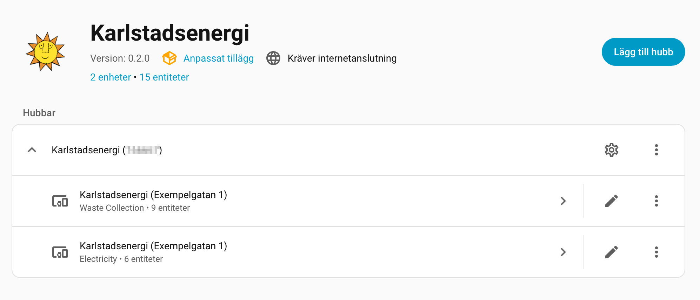
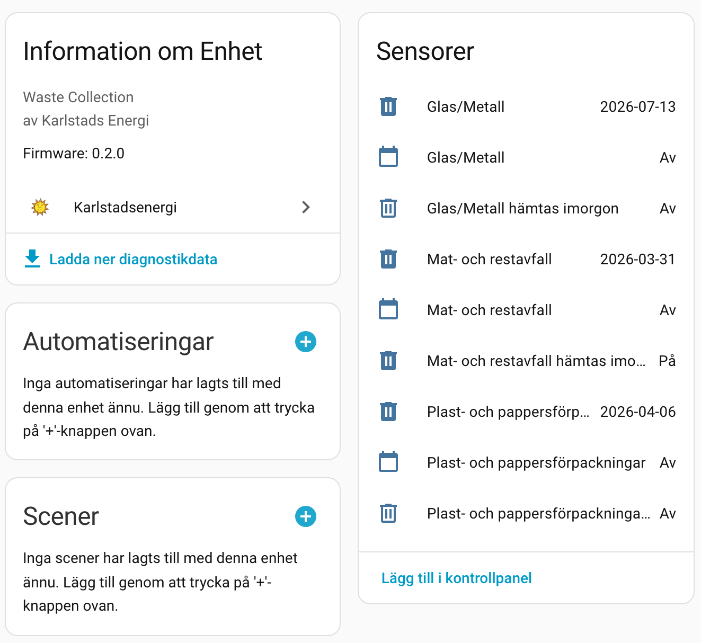
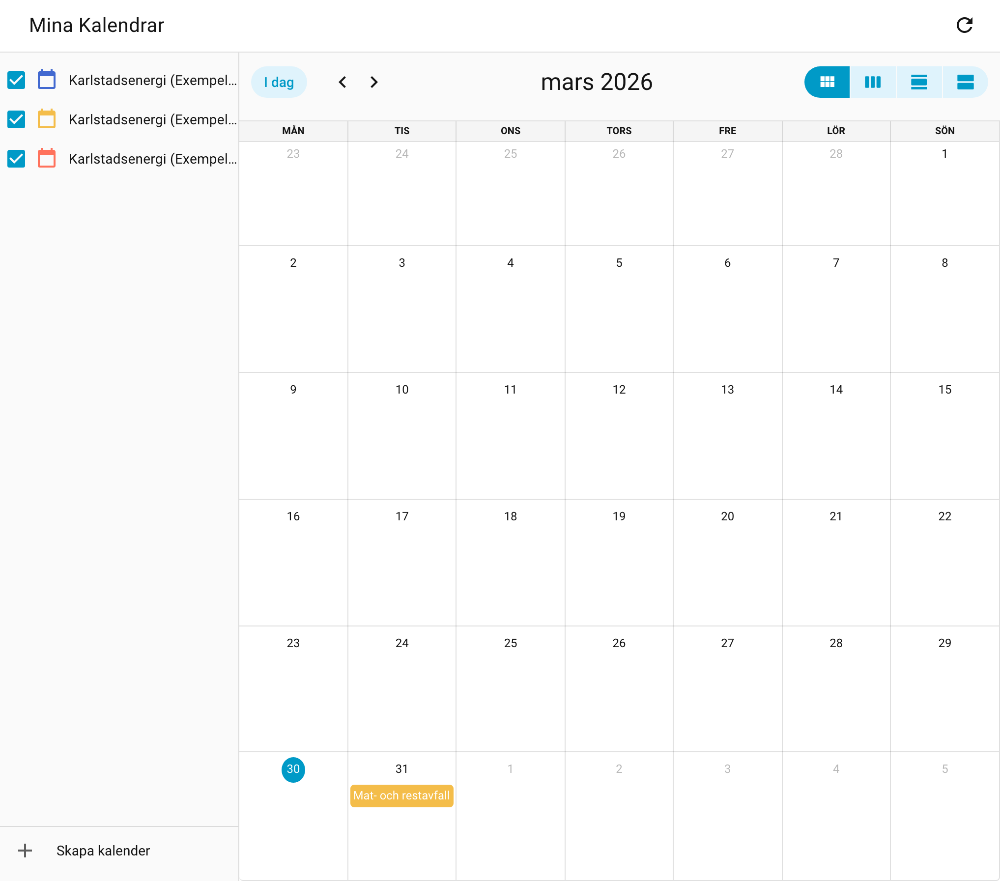
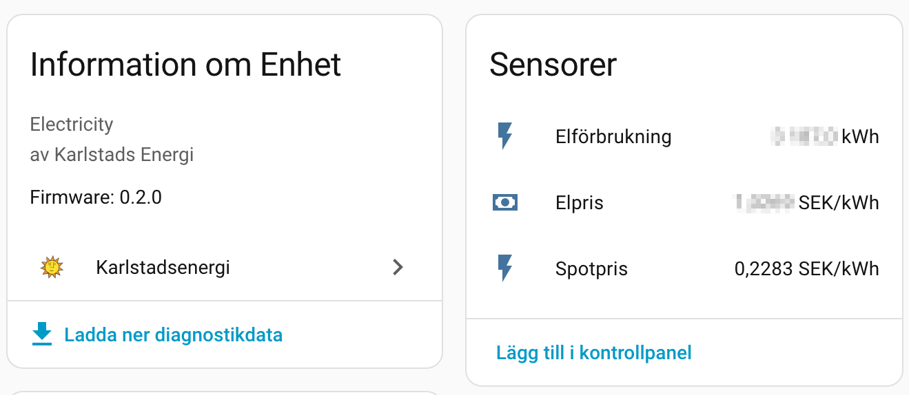
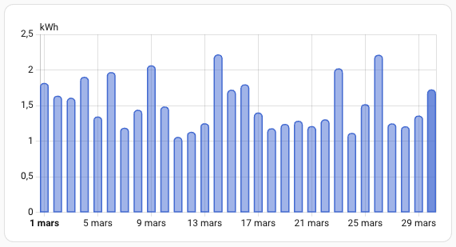
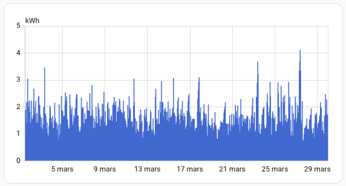
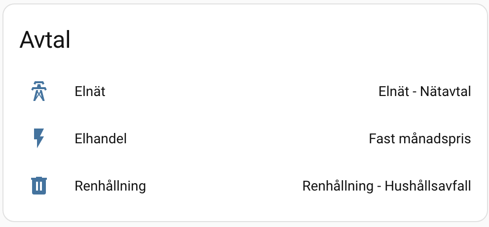

# Entities

> **Note:** Entity IDs shown in this document are examples. Your actual entity IDs depend on your address and installation. Check **Settings -> Devices & Services -> Karlstadsenergi** for your actual entity IDs.

All entities created by the Karlstadsenergi integration, grouped by type.



---

## Waste collection sensors



One sensor is created per active waste collection service at your address. Entity names use the Swedish waste type from the API (e.g. "Mat- och restavfall"). The entity IDs shown below are examples -- actual IDs are generated by HA from the Swedish names.

| Sensor | Entity ID example | State | Device class |
|--------|-------------------|-------|--------------|
| Mat- och restavfall | `sensor.karlstadsenergi_mat_och_restavfall` | Next pickup date | `date` |
| Glas/Metall | `sensor.karlstadsenergi_glas_metall` | Next pickup date | `date` |
| Plast- och pappersförpackningar | `sensor.karlstadsenergi_plast_och_pappersforpackningar` | Next pickup date | `date` |

### Waste sensor attributes

When the integration retrieves full service data (the normal case), all attributes below are available:

| Attribute | Type | Description |
|-----------|------|-------------|
| `address` | string | Pickup address |
| `container_size` | string | Container size (e.g. "240 L") |
| `frequency` | string | Pickup frequency (e.g. "Varannan vecka") |
| `service_id` | int | Internal service identifier |
| `days_until_pickup` | int | Days remaining until next pickup |
| `pickup_is_today` | bool | `true` if pickup is today |
| `pickup_is_tomorrow` | bool | `true` if pickup is tomorrow |

When the integration falls back to summary data (detailed services unavailable), `frequency` and `service_id` are not present. All other attributes are present when a pickup date is available.

---

## Waste collection calendar



One calendar entity per waste type, compatible with HA's built-in Calendar card and custom cards like Mushroom or TrashCard.

| Calendar | Entity ID example | Event |
|----------|-------------------|-------|
| Food & residual waste | `calendar.karlstadsenergi_food_and_residual_waste_calendar` | All-day event on pickup date |
| Glass/Metal | `calendar.karlstadsenergi_glass_metal_calendar` | All-day event on pickup date |
| Plastic & paper packaging | `calendar.karlstadsenergi_plastic_paper_packaging_calendar` | All-day event on pickup date |

> **Note:** Each calendar entity shows only the **next scheduled pickup**. The Karlstadsenergi API provides the next date only, not a full recurring schedule.

---

## Pickup tomorrow binary sensors

| Binary sensor | Entity ID example | State |
|---------------|-------------------|-------|
| Food & residual waste | `binary_sensor.karlstadsenergi_food_and_residual_waste_pickup_tomorrow` | `on` if pickup is tomorrow |
| Glass/Metal | `binary_sensor.karlstadsenergi_glass_metal_pickup_tomorrow` | `on` if pickup is tomorrow |
| Plastic & paper packaging | `binary_sensor.karlstadsenergi_plastic_paper_packaging_pickup_tomorrow` | `on` if pickup is tomorrow |

---

## Electricity consumption sensor



| Sensor | Entity ID example | State | Unit | Device class |
|--------|-------------------|-------|------|--------------|
| Electricity consumption | `sensor.karlstadsenergi_electricity_consumption` | Year-to-date consumption (kWh) | kWh | `energy` |

Note: the portal API provides historical data only. Consumption data may lag days or weeks behind real-time. The `latest_date` attribute shows the actual date of the most recent data point.

### Long-term statistics

Hourly consumption data is imported into Home Assistant's long-term statistics via `async_add_external_statistics`. This means hourly data is available in the Energy Dashboard and history graphs even though it originates from the portal API rather than a real-time meter.

<table>
  <tr>
    <td></td>
    <td></td>
  </tr>
</table>

The integration fetches historical data going back as far as the **Statistics history** setting allows (default: 2 years, configurable 1--10 years in Options). The portal API typically has data going back to the start of the customer contract. On the first coordinator refresh, all available historical data within the configured window is imported. Subsequent refreshes only add new data points -- existing statistics are not overwritten.

### Electricity sensor attributes

| Attribute | Type | Description |
|-----------|------|-------------|
| `total_last_year_period` | float | Same period last year |
| `difference_percentage` | float | Year-over-year change (%) |
| `average_daily` | float | Average daily consumption (current) |
| `average_daily_last_year` | float | Average daily consumption (last year) |
| `monthly_consumption` | dict | Monthly breakdown (`{"2026-01": 450.2, ...}`) |
| `latest_date` | string | Date of the most recent data point |
| `latest_daily_kwh` | float | kWh value for the most recent data point |
| `hourly_consumption` | list | Last 24 hours (`[{"time": "...", "kWh": 1.2}, ...]`) |
| `hourly_data_points` | int | Total number of hourly data points |

---

## Electricity price sensor

Derived from your invoice fee breakdown. This is a historical/retrospective price calculated from past invoices, not a real-time price. Use this or the spot price sensor as the price entity in the **Energy Dashboard**.

| Sensor | Entity ID example | State | Unit |
|--------|-------------------|-------|------|
| Electricity price | `sensor.karlstadsenergi_electricity_price` | Effective price | SEK/kWh |

### Price sensor attributes

| Attribute | Type | Description |
|-----------|------|-------------|
| `consumption_fee_sek` | float | Energy charge for the period (SEK) |
| `power_fee_sek` | float | Grid power fee (SEK) |
| `fixed_fee_sek` | float | Fixed monthly fee (SEK) |
| `energy_tax_sek` | float | Energy tax (SEK) |
| `vat_sek` | float | VAT (SEK) |
| `total_invoice_sek` | float | Total invoice amount (SEK) |
| `total_consumption_kwh` | float | Consumption for the fee period (kWh) |
| `total_variable_price_sek_kwh` | float | All variable costs per kWh (energy + grid + tax, ex VAT) |
| `fee_period_months` | list | Months covered by the fee data (e.g. `["2026-01", "2026-02"]`) |

---

## Cost breakdown sensors

Individual sensors for each fee component from the Karlstadsenergi invoice. Each sensor shows the latest month's amount. Monthly cost data is also imported into HA long-term statistics for Energy Dashboard integration and history graphs.

| Sensor | Entity ID example | State | Unit | Device class |
|--------|-------------------|-------|------|--------------|
| Consumption fee | `sensor.karlstadsenergi_consumption_fee` | Latest month energy charge | SEK | `monetary` |
| Power fee | `sensor.karlstadsenergi_power_fee` | Latest month grid/power fee | SEK | `monetary` |
| Fixed fee | `sensor.karlstadsenergi_fixed_fee` | Latest month fixed fee | SEK | `monetary` |
| Energy tax | `sensor.karlstadsenergi_energy_tax` | Latest month energy tax | SEK | `monetary` |
| VAT | `sensor.karlstadsenergi_vat` | Latest month VAT | SEK | `monetary` |
| Total cost | `sensor.karlstadsenergi_total_cost` | Latest month total invoice | SEK | `monetary` |

### Cost sensor attributes

| Attribute | Type | Description |
|-----------|------|-------------|
| `monthly_breakdown` | dict | Per-month amounts (`{"2026-01": 450.25, "2026-02": 520.10}`) |
| `fee_period_months` | list | Months covered by the data (e.g. `["2026-01", "2026-02"]`) |

### Long-term cost statistics

Monthly fee data is imported into HA long-term statistics via `async_add_external_statistics`, one statistic per fee type. The statistics appear in the Energy Dashboard and history graphs. Like hourly consumption, the history depth is controlled by the **Statistics history** setting in Options (default: 2 years).

| Statistic ID pattern | Description |
|---------------------|-------------|
| `karlstadsenergi:cost_consumption_fee_{id}` | Monthly energy charge (SEK) |
| `karlstadsenergi:cost_power_fee_{id}` | Monthly grid/power fee (SEK) |
| `karlstadsenergi:cost_fixed_fee_{id}` | Monthly fixed fee (SEK) |
| `karlstadsenergi:cost_energy_tax_{id}` | Monthly energy tax (SEK) |
| `karlstadsenergi:cost_vat_{id}` | Monthly VAT (SEK) |
| `karlstadsenergi:cost_total_cost_{id}` | Monthly total invoice (SEK) |

Each statistic tracks both the monthly value (`state`) and a running cumulative sum (`sum`). Only new months are imported on each coordinator refresh.

---

## Spot price sensor

Current Nord Pool electricity spot price for SE3 (Karlstad region), fetched from Karlstadsenergi's public Evado API every 15 minutes. No authentication required.

| Sensor | Entity ID example | State | Unit |
|--------|-------------------|-------|------|
| Spot price | `sensor.karlstadsenergi_spot_price` | Current spot price | SEK/kWh |

### Energy Dashboard configuration

To add these sensors to the HA Energy Dashboard:

1. Go to **Settings -> Dashboards -> Energy**.
2. Under **Electricity grid**, add a **Grid consumption** sensor. Two options:
   - `sensor.karlstadsenergi_electricity_consumption` -- auto-recorded by HA from the sensor state (year-to-date value, sampled at each update)
   - `Karlstadsenergi Electricity Consumption` (external statistic) -- imported hourly data from the portal API, more granular
3. For electricity cost tracking, you have three options:
   - **Price entity:** Add `sensor.karlstadsenergi_spot_price` or `sensor.karlstadsenergi_electricity_price` as the price entity. HA automatically calculates cost from consumption x price.
   - **Total cost statistic:** Use `karlstadsenergi:cost_total_cost_{id}` as a pre-calculated cost statistic from your actual invoices.

> **Tip:** The external statistic provides actual hourly consumption values from the portal, while the auto-recorded sensor tracks the cumulative year-to-date value. For the most accurate Energy Dashboard graphs, use the external statistic.

### Spot price attributes

| Attribute | Type | Description |
|-----------|------|-------------|
| `region` | string | Electricity region (`SE3`) |
| `price_ore_kwh` | float | Current price in öre/kWh |
| `today_min` | float | Today's lowest price (SEK/kWh) |
| `today_max` | float | Today's highest price (SEK/kWh) |
| `today_average` | float | Today's average price (SEK/kWh) |
| `tomorrow_min` | float | Tomorrow's lowest price (if available) |
| `tomorrow_max` | float | Tomorrow's highest price (if available) |
| `tomorrow_average` | float | Tomorrow's average price (if available) |
| `stale` | bool | `true` if the current price is past its validity window (Evado API may be down) |

---

## Contract sensors



One sensor per contract (grid, trading, waste). Entity IDs are based on the contract's internal `ContractId` from the API, not a fixed slug. The format is:

```
sensor.karlstadsenergi_CUSTOMERID_contract_CONTRACTID
```

where `CUSTOMERID` and `CONTRACTID` are the values returned by the API for your account. The exact IDs will differ between installations.

| Sensor | State |
|--------|-------|
| Grid contract | Contract alternative or utility type |
| Trading contract | Contract alternative or utility type |
| Waste contract | Contract alternative or utility type |

### Contract sensor attributes

| Attribute | Type | Description |
|-----------|------|-------------|
| `contract_id` | string | Internal contract ID |
| `contract_start_date` | string | Contract start date |
| `contract_end_date` | string | Contract end date (or "Tillsvidare") |
| `utility_name` | string | Utility type (e.g. "Elhandel - Handelsavtal") |
| `net_area_code` | string | Network area code |
| `electricity_region` | string | Electricity price region |

---

## Automation examples

### Notify when pickup is tomorrow

```yaml
automation:
  - alias: "Waste pickup reminder"
    trigger:
      - platform: state
        entity_id: binary_sensor.karlstadsenergi_food_and_residual_waste_pickup_tomorrow
        to: "on"
    action:
      - action: notify.mobile_app
        data:
          title: "Waste pickup tomorrow"
          message: "Food & residual waste pickup is tomorrow."
```

### Template sensor for days until pickup

```yaml
template:
  - sensor:
      - name: "Days until waste pickup"
        state: >
          {{ state_attr('sensor.karlstadsenergi_food_and_residual_waste', 'days_until_pickup') }}
        unit_of_measurement: "days"
```
